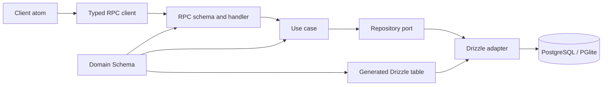
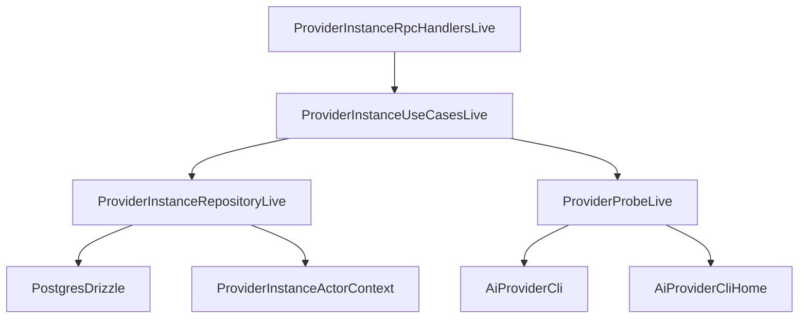
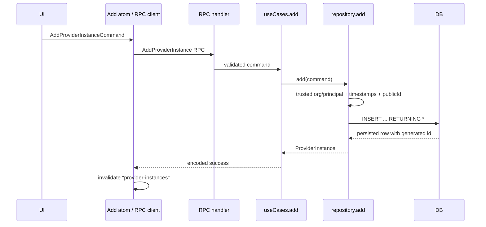

# Как устроен CRUD в `beep-effect`: полный разбор `ProviderInstance`

> Состояние исходного репозитория на 14 августа 2026 года, commit [`f83a02d`](https://github.com/beep-effect/beep-effect/tree/f83a02d794978d54120b49b94e96048921ec4e22).
>
> Этот документ описывает фактический код указанного коммита, а не абстрактную «идеальную архитектуру». В конце отдельно перечислены важные ограничения и расхождения между реализованным вертикальным срезом и его подключением к приложению.

## 1. Что именно мы разбираем

В качестве примера выбрана сущность `ProviderInstance` из slice `agents`.

**Slice** (вертикальный срез) — автономная продуктовая область, которая содержит собственные domain-модели, use cases, таблицы, серверные и клиентские адаптеры. В данном случае `ProviderInstance` описывает одну настроенную установку CLI-провайдера LLM:

- вид провайдера: `claude` или `codex`;
- путь к бинарному файлу;
- отдельный `HOME`;
- безопасные переменные окружения;
- пользовательскую метку;
- результат последней проверки авторизации.

Этот пример удобен тем, что в нем есть полный CRUD и дополнительная бизнес-операция `probe`:

| CRUD      | Операция проекта                    | Смысл                                          |
| --------- | ----------------------------------- | ---------------------------------------------- |
| Create    | `AddProviderInstance` / `add`       | создать настройку CLI-провайдера               |
| Read one  | `GetProviderInstance` / `get`       | получить одну настройку по `id`                |
| Read many | `ListProviderInstances` / `list`    | получить все настройки организации             |
| Update    | `UpdateProviderInstance` / `update` | заменить конфигурационные поля                 |
| Delete    | `RemoveProviderInstance` / `remove` | удалить настройку                              |
| Не CRUD   | `ProbeProviderInstance` / `probe`   | проверить авторизацию CLI и сохранить snapshot |

Главная идея: CRUD здесь не сосредоточен в одном «контроллере». Операция проходит через несколько границ, каждая из которых решает одну задачу.



## 2. Карта файлов

Один концепт распределен по пяти пакетам slice `agents`:

```text
packages/agents/
├── domain/
│   └── src/entities/ProviderInstance/
│       ├── ProviderInstance.model.ts
│       ├── ProviderInstance.values.ts
│       └── ProviderInstance.behavior.ts
├── use-cases/
│   └── src/entities/ProviderInstance/
│       ├── ProviderInstance.commands.ts
│       ├── ProviderInstance.errors.ts
│       ├── ProviderInstance.repository.ts
│       ├── ProviderInstance.use-cases.ts
│       ├── ProviderInstance.service.ts
│       └── ProviderInstance.rpc.ts
├── tables/
│   └── src/entities/ProviderInstance/
│       ├── ProviderInstance.table.ts
│       └── ProviderInstance.converters.ts
├── server/
│   └── src/ProviderInstance/
│       ├── ProviderInstance.repo.ts
│       ├── ProviderInstance.probe.ts
│       └── ProviderInstance.layer.ts
└── client/
    └── src/
        ├── ProviderInstance.service.ts
        └── ProviderInstance.atoms.ts
```

Назначение пакетов:

| Пакет       | Что знает                                                                         | Чего не должен знать                                     |
| ----------- | --------------------------------------------------------------------------------- | -------------------------------------------------------- |
| `domain`    | сущность, value objects, инварианты, чистое поведение                             | SQL, HTTP/RPC transport, React, Drizzle, live-сервисы    |
| `use-cases` | намерения пользователя, сценарии, порты, публичные ошибки, RPC-контракт           | конкретная база, SQL-запросы, процесс запуска приложения |
| `tables`    | отображение domain-схемы на Drizzle-таблицу и row codecs                          | выполнение запросов и бизнес-сценарии                    |
| `server`    | реализации портов, Drizzle-запросы, CLI adapter, `Layer`-композиция, RPC handlers | UI-состояние                                             |
| `client`    | typed RPC client, reactive atoms, обновление клиентского кеша                     | Drizzle и серверные порты                                |

Это соответствует описанной авторами hexagonal architecture — **гексагональной архитектуре**, где внутренний код задает интерфейсы-порты, а внешний код предоставляет адаптеры. Правило репозитория сформулировано как `domain <- use-cases <- server`: внешние слои импортируют внутренние, но не наоборот ([architecture rule](https://github.com/beep-effect/beep-effect/blob/f83a02d794978d54120b49b94e96048921ec4e22/standards/architecture/01-hexagonal-vertical-slices.md#L50-L57)).

## 3. Минимальная модель Effect, нужная для чтения кода

### 3.1 `Effect<Success, Error, Requirements>`

Упрощенно:

```ts
Effect.Effect<A, E, R>;
```

означает вычисление, которое:

- при успехе возвращает `A`;
- ожидаемо может завершиться ошибкой `E`;
- для запуска требует зависимости `R` из Effect Context.

Например, repository port объявляет:

```ts
(id) =>
  Effect.Effect<
    ProviderInstance,
    ProviderInstanceNotFound | ProviderProbeUnavailable
  >;
```

Значит, `get` либо возвращает сущность, либо дает одну из двух типизированных ошибок. Это не `Promise<ProviderInstance>` с неявным `throw unknown`.

### 3.2 `Schema`

`effect/Schema` одновременно используется для:

1. runtime-валидации неизвестных данных;
2. вывода TypeScript-типа;
3. кодирования данных на wire/в БД;
4. описания RPC payload, success и error;
5. построения metadata для таблицы.

Поэтому TypeScript-интерфейс не является единственной защитой. Вход действительно декодируется схемой во время выполнения.

### 3.3 `Context.Service`

`Context.Service` создает типизированный ключ зависимости. Например:

```ts
class ProviderInstanceRepository extends Context.Service<...>()(...) {}
```

Use case зависит от этого контракта, а не от Drizzle. В production Context получает live-реализацию, в тесте — небольшую in-memory реализацию.

### 3.4 `Layer`

**Layer** (слой зависимостей) — рецепт построения сервисов Effect. Например:

```text
PostgresDrizzle + ActorContext
            ↓
ProviderInstanceRepository
            ↓
ProviderInstanceUseCases
            ↓
ProviderInstance RPC handlers
```

`Layer.provide` удовлетворяет зависимости нижнего слоя; `Layer.provideMerge` предоставляет зависимости и сохраняет произведенные сервисы для дальнейшей композиции.

## 4. Domain: что является сущностью

### 4.1 Типизированный идентификатор

`ProviderInstanceId` создается через factory slice `agents`:

```ts
const make = EntityId.factory("agents", $I)
export const ProviderInstanceId = make("provider_instance", ...)
```

Источник: [`packages/shared/domain/src/identity/Agents.ts`](https://github.com/beep-effect/beep-effect/blob/f83a02d794978d54120b49b94e96048921ec4e22/packages/shared/domain/src/identity/Agents.ts#L8-L12), [`ProviderInstanceId`](https://github.com/beep-effect/beep-effect/blob/f83a02d794978d54120b49b94e96048921ec4e22/packages/shared/domain/src/identity/Agents.ts#L54-L92).

Практический смысл: `ProviderInstanceId` — branded type, а не произвольный `number`. Его нельзя без проверки смешать, например, с `OrganizationId`.

Из identity metadata также получается имя таблицы `agents_provider_instance` и тип сущности `AgentsProviderInstance`.

### 4.2 Общие поля `BaseEntity`

`ProviderInstance` расширяет общую `BaseEntity`. Поэтому кроме собственных полей она получает:

```text
id
publicId
entityType
createdAt
createdByPrincipal
updatedAt
updatedByPrincipal
orgId
rowVersion
schemaVersion
source
```

Источник общих полей: [`BaseEntity.fields`](https://github.com/beep-effect/beep-effect/blob/f83a02d794978d54120b49b94e96048921ec4e22/packages/shared/domain/src/entity/BaseEntity.ts#L65-L89).

Persistence metadata сразу фиксирует, откуда берется поле:

| Поле                                       | Стратегия                   |
| ------------------------------------------ | --------------------------- |
| `id`                                       | `generatedOnInsert`         |
| `publicId`                                 | `computedByServiceOnInsert` |
| `orgId`                                    | `providedByContext`         |
| `createdAt`                                | `defaultedOnInsert`         |
| `updatedAt`                                | `updatedOnWrite`            |
| `rowVersion`                               | `incrementedOnWrite`        |
| `createdByPrincipal`, `updatedByPrincipal` | `providedByContext`         |

Источники: [`BaseEntity.persisted`](https://github.com/beep-effect/beep-effect/blob/f83a02d794978d54120b49b94e96048921ec4e22/packages/shared/domain/src/entity/BaseEntity.ts#L91-L132), [identity persistence](https://github.com/beep-effect/beep-effect/blob/f83a02d794978d54120b49b94e96048921ec4e22/packages/shared/domain/src/entity/BaseEntity.ts#L146-L165).

Важно: metadata описывает намерение и позволяет генерировать схему, но фактическую семантику записи все равно нужно проверить в repository adapter. Например, ниже увидим, что `rowVersion` увеличивается, однако не участвует в `WHERE` обновления.

### 4.3 Собственные поля `ProviderInstance`

Модель объявлена через `BaseEntity.Class`:

```ts
export class ProviderInstance extends BaseEntity.Class(...)(
  Agents.ProviderInstanceId,
  {
    fields: {
      binaryPath,
      envVars,
      homePath,
      kind,
      label,
      lastProbe,
    },
    persisted: {
      // способ хранения и физические column names
    },
  },
) {}
```

Полный источник: [`ProviderInstance.model.ts`](https://github.com/beep-effect/beep-effect/blob/f83a02d794978d54120b49b94e96048921ec4e22/packages/agents/domain/src/entities/ProviderInstance/ProviderInstance.model.ts#L39-L87).

Ключевые поля:

| Поле         | Domain-тип                          | Хранение                       |
| ------------ | ----------------------------------- | ------------------------------ |
| `binaryPath` | непустой branded string             | `text`, `binary_path`          |
| `envVars`    | record безопасных env vars          | `jsonb`, `env_vars`            |
| `homePath`   | `Option<HomePath>`                  | nullable `text`, `home_path`   |
| `kind`       | literal union `"claude" \| "codex"` | literal/text, `kind`           |
| `label`      | trimmed string длиной 1–120         | `text`, `label`                |
| `lastProbe`  | `Option<AuthSnapshot>`              | nullable `jsonb`, `last_probe` |

`Option` — явное представление наличия/отсутствия значения. Через `S.OptionFromNullOr(...)` отсутствие кодируется в SQL/RPC как `null`, а внутри domain-кода остается `Option.none()`.

### 4.4 Валидация и безопасность

`InstanceLabel` проверяет непустое, обрезанное значение до 120 символов. `ProviderKind` является закрытым словарем `claude | codex`.

Особенно важен `EnvVars`: схема разрешает корректные имена переменных, но отклоняет token-bearing names, включая `ANTHROPIC_API_KEY`, `OPENAI_API_KEY`, `*_TOKEN`, `*_SECRET`, `*_KEY`. Источник: [`ProviderInstance.values.ts`](https://github.com/beep-effect/beep-effect/blob/f83a02d794978d54120b49b94e96048921ec4e22/packages/agents/domain/src/entities/ProviderInstance/ProviderInstance.values.ts#L18-L25), [`EnvVars` schema](https://github.com/beep-effect/beep-effect/blob/f83a02d794978d54120b49b94e96048921ec4e22/packages/agents/domain/src/entities/ProviderInstance/ProviderInstance.values.ts#L193-L294).

Инвариант модели: база хранит конфигурацию и безопасный snapshot, но не access token, refresh token, OAuth code или raw CLI output ([model comment](https://github.com/beep-effect/beep-effect/blob/f83a02d794978d54120b49b94e96048921ec4e22/packages/agents/domain/src/entities/ProviderInstance/ProviderInstance.model.ts#L17-L26)).

### 4.5 Чистое domain-поведение

`loginGuidance(kind, snapshot)` строит сообщение для пользователя. Функция не обращается к базе или сети и исчерпывающе сопоставляет:

- каждый `AuthSnapshot.status`;
- каждый `ProviderKind`.

При добавлении нового variant или provider kind TypeScript потребует обновить mapping. Источник: [`ProviderInstance.behavior.ts`](https://github.com/beep-effect/beep-effect/blob/f83a02d794978d54120b49b94e96048921ec4e22/packages/agents/domain/src/entities/ProviderInstance/ProviderInstance.behavior.ts#L43-L66).

Это хороший пример правила: чистое бизнес-решение находится в domain; запуск CLI и сохранение результата — во внешних слоях.

## 5. Commands и Queries: намерения на границе приложения

Use-case package не принимает «любой объект». Для каждой операции есть отдельная Schema-класс:

| Класс                           | Поля                             |
| ------------------------------- | -------------------------------- |
| `AddProviderInstanceCommand`    | конфигурационные поля без `id`   |
| `UpdateProviderInstanceCommand` | `id` + все конфигурационные поля |
| `RemoveProviderInstanceCommand` | `id`                             |
| `ProbeProviderInstanceCommand`  | `id`                             |
| `GetProviderInstanceQuery`      | `id`                             |
| `ListProviderInstancesQuery`    | пустой объект                    |

Источник: [`ProviderInstance.commands.ts`](https://github.com/beep-effect/beep-effect/blob/f83a02d794978d54120b49b94e96048921ec4e22/packages/agents/use-cases/src/entities/ProviderInstance/ProviderInstance.commands.ts#L16-L22), [все команды и queries](https://github.com/beep-effect/beep-effect/blob/f83a02d794978d54120b49b94e96048921ec4e22/packages/agents/use-cases/src/entities/ProviderInstance/ProviderInstance.commands.ts#L24-L159).

Почему не передавать `ProviderInstance` прямо из клиента:

1. клиент не должен задавать `orgId`;
2. клиент не должен назначать audit fields;
3. `id` создает база;
4. `lastProbe` формируется серверной операцией `probe`, а не пользовательским CRUD payload;
5. команда выражает намерение, а не физическую строку таблицы.

`UpdateProviderInstanceCommand` — это **full replacement command**, а не PATCH. В нем обязательны все пять конфигурационных полей. Частичное обновление здесь не реализовано.

## 6. Repository port: что нужно use case, но без Drizzle

**Port** (порт) — интерфейс требуемой capability на языке продукта. Он объявлен во внутреннем `use-cases`, а реализован внешним `server` adapter.

```ts
interface ProviderInstanceRepositoryShape {
  add(command): Effect<ProviderInstance, ProviderProbeUnavailable>;
  get(
    id,
  ): Effect<
    ProviderInstance,
    ProviderInstanceNotFound | ProviderProbeUnavailable
  >;
  list: Effect<ReadonlyArray<ProviderInstance>, ProviderProbeUnavailable>;
  remove(id): Effect<void, ProviderInstanceNotFound | ProviderProbeUnavailable>;
  save(
    instance,
  ): Effect<
    ProviderInstance,
    ProviderInstanceNotFound | ProviderProbeUnavailable
  >;
}
```

Источник: [`ProviderInstance.repository.ts`](https://github.com/beep-effect/beep-effect/blob/f83a02d794978d54120b49b94e96048921ec4e22/packages/agents/use-cases/src/entities/ProviderInstance/ProviderInstance.repository.ts#L73-L100).

Обратите внимание на названия:

- публичный use case называется `update`;
- repository знает более низкоуровневую операцию `save` целой сущности;
- use case сам решает, как из команды и текущего состояния получить новую сущность.

Так бизнес-правило обновления не утекает в SQL adapter.

### 6.1 Tenant/actor context

Repository также требует `ProviderInstanceActorContext`:

```ts
{
  orgId: OrganizationId,
  principal: Principal,
}
```

Источник: [`ProviderInstanceActorScope`](https://github.com/beep-effect/beep-effect/blob/f83a02d794978d54120b49b94e96048921ec4e22/packages/agents/use-cases/src/entities/ProviderInstance/ProviderInstance.repository.ts#L21-L71).

Это доверенный server-side context:

- `orgId` ограничивает каждую операцию текущей организацией;
- `principal` записывается в audit fields;
- эти значения не берутся из RPC command пользователя.

Это принципиальная security boundary. Если принимать `orgId` из body запроса, клиент мог бы запросить чужую организацию.

## 7. Use-case service: где находится логика CRUD

Публичный контракт сервиса перечисляет шесть операций и их типизированную ошибку `ProviderActionError`: [`ProviderInstance.use-cases.ts`](https://github.com/beep-effect/beep-effect/blob/f83a02d794978d54120b49b94e96048921ec4e22/packages/agents/use-cases/src/entities/ProviderInstance/ProviderInstance.use-cases.ts#L39-L72).

Factory `makeProviderInstanceUseCases(repository, providerProbe)` получает два порта:

- persistence repository;
- product-neutral CLI probe.

Он возвращает реализацию сценариев, не зная ни Drizzle, ни PostgreSQL, ни конкретного process runner.

### 7.1 Create: `add`

```ts
add(command) {
  return repository.add(command)
}
```

Источник: [`ProviderInstance.service.ts#L44-L46`](https://github.com/beep-effect/beep-effect/blob/f83a02d794978d54120b49b94e96048921ec4e22/packages/agents/use-cases/src/entities/ProviderInstance/ProviderInstance.service.ts#L44-L46).

Здесь нет дополнительного бизнес-решения: команда уже провалидирована, а server adapter должен добавить доверенные metadata и выполнить insert.

Полный путь:

```text
AddProviderInstanceCommand
  -> useCases.add
  -> repository.add
  -> generate publicId
  -> add orgId/principal/timestamps/defaults
  -> INSERT ... RETURNING *
  -> decode row as ProviderInstance
  -> RPC success
```

### 7.2 Read one: `get`

```ts
get(query) {
  return repository.get(query.id)
}
```

Источник: [`ProviderInstance.service.ts#L85-L87`](https://github.com/beep-effect/beep-effect/blob/f83a02d794978d54120b49b94e96048921ec4e22/packages/agents/use-cases/src/entities/ProviderInstance/ProviderInstance.service.ts#L85-L87).

Use case передает только branded `id`. Tenant scope добавляется repository adapter из доверенного Context.

### 7.3 Read many: `list`

```ts
list(_query) {
  return repository.list
}
```

Источник: [`ProviderInstance.service.ts#L88-L90`](https://github.com/beep-effect/beep-effect/blob/f83a02d794978d54120b49b94e96048921ec4e22/packages/agents/use-cases/src/entities/ProviderInstance/ProviderInstance.service.ts#L88-L90).

Query пока пустой: pagination, filters и sorting от клиента отсутствуют. Adapter возвращает строки текущей организации по возрастанию `id`.

### 7.4 Update: `update`

Это самый показательный CRUD-сценарий:

```ts
const current = yield * repository.get(command.id);
return (
  yield *
  repository.save(
    ProviderInstance.make({
      ...current,
      binaryPath: command.binaryPath,
      envVars: command.envVars,
      homePath: command.homePath,
      kind: command.kind,
      label: command.label,
    }),
  )
);
```

Источник: [`ProviderInstance.service.ts#L47-L59`](https://github.com/beep-effect/beep-effect/blob/f83a02d794978d54120b49b94e96048921ec4e22/packages/agents/use-cases/src/entities/ProviderInstance/ProviderInstance.service.ts#L47-L59).

Почему сначала `get`, а затем `save`:

1. проверяется существование сущности в scope текущей организации;
2. сохраняются server-owned поля текущей сущности: `orgId`, `publicId`, timestamps, audit metadata;
3. сохраняется `lastProbe`, потому что команда его не контролирует;
4. меняются только пять разрешенных конфигурационных полей;
5. создается новая immutable domain value, а не мутируется старый объект.

Полный путь:

```text
UpdateProviderInstanceCommand
  -> repository.get(id, implicit orgId)
  -> merge allowed fields into current entity
  -> repository.save(new entity)
  -> UPDATE ... SET ... WHERE id = ? AND org_id = ? RETURNING *
```

### 7.5 Delete: `remove`

```ts
remove(command) {
  return repository.remove(command.id)
}
```

Источник: [`ProviderInstance.service.ts#L60-L62`](https://github.com/beep-effect/beep-effect/blob/f83a02d794978d54120b49b94e96048921ec4e22/packages/agents/use-cases/src/entities/ProviderInstance/ProviderInstance.service.ts#L60-L62).

Возвращаемый success type — `void`. Если `DELETE ... RETURNING id` не вернул строку, adapter возвращает `ProviderInstanceNotFound`.

### 7.6 Дополнительный use case: `probe`

`probe` показывает, зачем нужен отдельный application layer, даже если простой CRUD кажется «прямым вызовом repository»:

1. загрузить текущую сущность;
2. передать безопасную конфигурацию в `ProviderProbe`;
3. получить `AuthSnapshot`;
4. сохранить snapshot в `lastProbe`;
5. после сохранения интерпретировать результат:
   - `authenticated` -> вернуть обновленную сущность;
   - `unauthenticated` -> вернуть typed error с точной login-командой;
   - `probe-failed` -> вернуть unavailable error с guidance.

Источник: [`ProviderInstance.service.ts#L63-L84`](https://github.com/beep-effect/beep-effect/blob/f83a02d794978d54120b49b94e96048921ec4e22/packages/agents/use-cases/src/entities/ProviderInstance/ProviderInstance.service.ts#L63-L84).

Тонкий, но важный момент: snapshot сохраняется **до** возврата `ProviderUnauthenticated`. То есть ошибка операции для пользователя не означает rollback уже полученного полезного состояния. Это подтверждает use-case test: logged-out snapshot остается в repository, хотя сам Effect завершается через error channel ([test](https://github.com/beep-effect/beep-effect/blob/f83a02d794978d54120b49b94e96048921ec4e22/packages/agents/use-cases/test/ProviderInstance.test.ts#L122-L140)).

## 8. Таблица: Domain Schema как источник metadata

В `tables` нет ручного повторения каждого столбца:

```ts
export const providerInstanceTable = EntityTable.pgTableFrom(
  DomainProviderInstance.ProviderInstance,
);
```

Источник: [`ProviderInstance.table.ts`](https://github.com/beep-effect/beep-effect/blob/f83a02d794978d54120b49b94e96048921ec4e22/packages/agents/tables/src/entities/ProviderInstance/ProviderInstance.table.ts#L39-L61).

`EntityTable.pgTableFrom` читает persistence metadata модели и строит Drizzle table. Физическое имя — `agents_provider_instance`.

Плюс подхода: domain-схема, wire codec и таблица меньше расходятся. Но это не отменяет migrations: фактическая production database schema должна быть приведена к сгенерированному контракту.

### 8.1 Entity ↔ row converters

Два converter-а:

```ts
toProviderInstanceInsert(entity);
fromProviderInstanceRow(row);
```

- `fromProviderInstanceRow` runtime-декодирует неизвестную строку БД через `ProviderInstance` Schema;
- `toProviderInstanceInsert` кодирует сущность и удаляет `id`, чтобы PostgreSQL sequence создала его сама.

Источник: [`ProviderInstance.converters.ts`](https://github.com/beep-effect/beep-effect/blob/f83a02d794978d54120b49b94e96048921ec4e22/packages/agents/tables/src/entities/ProviderInstance/ProviderInstance.converters.ts#L51-L102), [decode row](https://github.com/beep-effect/beep-effect/blob/f83a02d794978d54120b49b94e96048921ec4e22/packages/agents/tables/src/entities/ProviderInstance/ProviderInstance.converters.ts#L104-L140).

Важно отличать:

- TypeScript `$inferSelect` проверяет форму на compile time;
- `S.decodeUnknownSync(ProviderInstance)` проверяет реальные значения на runtime.

## 9. Drizzle repository adapter: фактический SQL CRUD

Factory `makeProviderInstanceRepository` получает из Effect Context:

- `PostgresDrizzle`;
- `ProviderInstanceActorContext`;
- контекст генератора public id.

Затем возвращает значение, удовлетворяющее `ProviderInstanceRepository` port. Источник: [`ProviderInstance.repo.ts#L94-L171`](https://github.com/beep-effect/beep-effect/blob/f83a02d794978d54120b49b94e96048921ec4e22/packages/agents/server/src/ProviderInstance/ProviderInstance.repo.ts#L94-L171).

### 9.1 Общий перевод driver errors

Helper `unavailable(operation)`:

1. логирует техническую причину на debug-уровне вместе с operation и table;
2. заменяет любую ошибку нижнего уровня на клиентобезопасный `ProviderProbeUnavailable`;
3. не выпускает наружу Drizzle/Postgres error.

Источник: [`ProviderInstance.repo.ts#L39-L53`](https://github.com/beep-effect/beep-effect/blob/f83a02d794978d54120b49b94e96048921ec4e22/packages/agents/server/src/ProviderInstance/ProviderInstance.repo.ts#L39-L53).

Это adapter boundary: внешний driver error переводится в ошибку продуктового контракта.

### 9.2 Create SQL

До INSERT helper `insertFromCommand` формирует server-owned значения:

- текущее время;
- `createdByPrincipal` и `updatedByPrincipal` из actor scope;
- `orgId` из actor scope;
- `lastProbe: null`;
- `source: "Application"`;
- `schemaVersion: "0.1.0"`;
- `rowVersion: 1`;
- сгенерированный `publicId`.

Источник: [`insertFromCommand`](https://github.com/beep-effect/beep-effect/blob/f83a02d794978d54120b49b94e96048921ec4e22/packages/agents/server/src/ProviderInstance/ProviderInstance.repo.ts#L55-L79).

SQL через Drizzle:

```ts
db.insert(providerInstanceTable).values(insert).returning();
```

`RETURNING` важен: база генерирует `id`, repository сразу получает полную persisted row и декодирует ее в domain entity.

Если `RETURNING` неожиданно вернул пустой массив, это считается persistence failure, а не «успешным созданием без результата».

### 9.3 Get SQL и tenant isolation

```ts
SELECT *
FROM agents_provider_instance
WHERE id = :id AND org_id = :trustedOrgId
LIMIT 1
```

Drizzle-код: [`ProviderInstance.repo.ts#L124-L136`](https://github.com/beep-effect/beep-effect/blob/f83a02d794978d54120b49b94e96048921ec4e22/packages/agents/server/src/ProviderInstance/ProviderInstance.repo.ts#L124-L136).

Если запись имеет нужный `id`, но принадлежит другой организации, запрос ничего не возвращает и клиент получает `ProviderInstanceNotFound`. Это не раскрывает существование чужой записи.

### 9.4 List SQL

```ts
SELECT *
FROM agents_provider_instance
WHERE org_id = :trustedOrgId
ORDER BY id ASC
```

Drizzle-код: [`ProviderInstance.repo.ts#L137-L142`](https://github.com/beep-effect/beep-effect/blob/f83a02d794978d54120b49b94e96048921ec4e22/packages/agents/server/src/ProviderInstance/ProviderInstance.repo.ts#L137-L142).

Каждая строка проходит `fromProviderInstanceRow`. Если persisted data нарушает текущую Schema, операция не вернет полусломанную сущность.

### 9.5 Delete SQL

```ts
DELETE FROM agents_provider_instance
WHERE id = :id AND org_id = :trustedOrgId
RETURNING id
```

Drizzle-код: [`ProviderInstance.repo.ts#L143-L150`](https://github.com/beep-effect/beep-effect/blob/f83a02d794978d54120b49b94e96048921ec4e22/packages/agents/server/src/ProviderInstance/ProviderInstance.repo.ts#L143-L150).

Зачем `RETURNING id`: affected row count выражается результатом запроса. Пустой результат переводится в typed not-found.

### 9.6 Update SQL

Adapter вычисляет новые audit-поля:

- `rowVersion = instance.rowVersion + 1`;
- `updatedAt = now`;
- `updatedByPrincipal = trusted principal`;
- `orgId` принудительно заменяется trusted scope.

Далее:

```ts
db.update(providerInstanceTable)
  .set(...)
  .where(id = instance.id AND orgId = trustedOrgId)
  .returning()
```

Источник: [`ProviderInstance.repo.ts#L151-L169`](https://github.com/beep-effect/beep-effect/blob/f83a02d794978d54120b49b94e96048921ec4e22/packages/agents/server/src/ProviderInstance/ProviderInstance.repo.ts#L151-L169).

Даже если внутрь `save` ошибочно передать entity другой организации, adapter не использует ее `orgId` для выбора строки и перезаписывает persisted `orgId` trusted значением.

## 10. RPC: типизированная transport boundary

Здесь используется Effect RPC, а не классический REST controller.

Для каждой операции задаются три Schema:

```ts
Rpc.make('AddProviderInstance', {
  payload: AddProviderInstanceCommand,
  success: ProviderInstance,
  error: ProviderActionError,
});
```

Аналогично объявлены update, remove, probe, get и list. Для remove success schema — `S.Void`, для list — `S.Array(ProviderInstance)`.

Источник: [`ProviderInstance.rpc.ts`](https://github.com/beep-effect/beep-effect/blob/f83a02d794978d54120b49b94e96048921ec4e22/packages/agents/use-cases/src/entities/ProviderInstance/ProviderInstance.rpc.ts#L21-L128).

После этого RPC объединяются в `ProviderInstanceRpcs` group ([group](https://github.com/beep-effect/beep-effect/blob/f83a02d794978d54120b49b94e96048921ec4e22/packages/agents/use-cases/src/entities/ProviderInstance/ProviderInstance.rpc.ts#L130-L150)).

Что дает контракт:

1. payload декодируется соответствующей command/query Schema;
2. success кодируется domain Schema;
3. ожидаемая ошибка кодируется закрытым `ProviderActionError` union;
4. клиент получает методы с теми же inferred TypeScript types;
5. названия RPC — часть wire protocol.

### 10.1 RPC handlers почти ничего не решают

Server handler layer только связывает имена protocol operations с use-case methods:

```ts
ProviderInstanceRpcs.of({
  AddProviderInstance: useCases.add,
  GetProviderInstance: useCases.get,
  ListProviderInstances: useCases.list,
  ProbeProviderInstance: useCases.probe,
  RemoveProviderInstance: useCases.remove,
  UpdateProviderInstance: useCases.update,
});
```

Источник: [`ProviderInstance.layer.ts#L87-L99`](https://github.com/beep-effect/beep-effect/blob/f83a02d794978d54120b49b94e96048921ec4e22/packages/agents/server/src/ProviderInstance/ProviderInstance.layer.ts#L87-L99).

Это намеренно тонкий adapter. Если поместить бизнес-логику в handler, она станет зависимой от RPC и ее придется дублировать для HTTP, CLI или background job.

## 11. Layer composition: как реализации встречаются с интерфейсами

В server layer по отдельности строятся:

1. `ProviderInstanceRepositoryLive` — реализация persistence port;
2. `ProviderProbeLive` — реализация CLI probe port;
3. `ProviderInstanceUseCasesLive` — use cases поверх этих двух портов;
4. `ProviderInstanceRpcHandlersLive` — protocol handlers поверх use cases.

Финальная композиция:

```ts
ProviderInstanceRpcHandlersLive.pipe(
  Layer.provideMerge(ProviderInstanceUseCasesLive),
  Layer.provideMerge(PortsLive),
  Layer.provideMerge(AiProviderCliHome.layer),
  Layer.provideMerge(AiProviderCli.makeLayer()),
);
```

Источник: [`ProviderInstance.layer.ts`](https://github.com/beep-effect/beep-effect/blob/f83a02d794978d54120b49b94e96048921ec4e22/packages/agents/server/src/ProviderInstance/ProviderInstance.layer.ts#L34-L120).

Ментальная модель:



Важное уточнение: `ProviderInstanceLive` композирует concept-local части и CLI dependencies, но database/actor runtime context все равно должен прийти с composition root приложения. «Live» не означает «можно запустить без внешних требований».

## 12. Client: вызов RPC и обновление reactive cache

### 12.1 Typed client

`ProviderInstanceTransport` строится из той же RPC group:

```ts
RpcClient.make(ProviderInstanceRpcs, { flatten: true });
```

Источник: [`ProviderInstance.service.ts`](https://github.com/beep-effect/beep-effect/blob/f83a02d794978d54120b49b94e96048921ec4e22/packages/agents/client/src/ProviderInstance.service.ts#L18-L42).

`ProviderInstanceClient` использует этот typed client через `AtomRpc.Service`. По умолчанию transport берет общий `chatProtocolLayerAtom`; он указывает на HTTP RPC endpoint, а приложение может заменить его IPC transport до монтирования UI ([client service](https://github.com/beep-effect/beep-effect/blob/f83a02d794978d54120b49b94e96048921ec4e22/packages/agents/client/src/ProviderInstance.service.ts#L44-L86)).

### 12.2 Query atom

Список представлен query atom:

```ts
ProviderInstanceClient.query(
  'ListProviderInstances',
  {},
  { reactivityKeys: ['provider-instances'] },
);
```

Источник: [`ProviderInstance.atoms.ts#L18-L39`](https://github.com/beep-effect/beep-effect/blob/f83a02d794978d54120b49b94e96048921ec4e22/packages/agents/client/src/ProviderInstance.atoms.ts#L18-L39).

### 12.3 Mutation atoms и invalidation

Add/update/remove/probe atoms вызывают соответствующий RPC и передают общий reactivity key в `Reactivity.mutation`.

После успешной mutation все query atoms с ключом `provider-instances` становятся stale и перечитывают список. Источник: [`ProviderInstance.atoms.ts#L41-L128`](https://github.com/beep-effect/beep-effect/blob/f83a02d794978d54120b49b94e96048921ec4e22/packages/agents/client/src/ProviderInstance.atoms.ts#L41-L128).

Таким образом, UI не обязан вручную делать:

```text
await update(...)
await list(...)
setLocalState(...)
```

Cache invalidation связывает mutation со списком декларативно.

При этом отдельного exported `getProviderInstanceAtom(id)` в рассмотренном файле нет, хотя `GetProviderInstance` RPC существует. Текущий client surface ориентирован на список и mutations.

## 13. Полный end-to-end путь каждой операции

### 13.1 Create



### 13.2 Read one/list

```text
RPC payload Schema
  -> handler
  -> useCases.get/list
  -> repository
  -> SELECT constrained by trusted orgId
  -> runtime row decode
  -> ProviderInstance / ProviderInstance[]
```

### 13.3 Update

```text
Update command (id + full config)
  -> SELECT current by id AND orgId
  -> preserve server-owned/current fields
  -> replace allowed config fields
  -> UPDATE by id AND orgId
  -> increment rowVersion and audit fields
  -> RETURNING + runtime decode
  -> invalidate list cache
```

### 13.4 Delete

```text
Remove command
  -> DELETE by id AND orgId RETURNING id
  -> empty result => ProviderInstanceNotFound
  -> success => void
  -> invalidate list cache
```

## 14. Ошибки: как они движутся по слоям

Публичный union содержит:

- `ProviderInstanceNotFound`;
- `ProviderUnauthenticated`;
- `ProviderProbeUnavailable`.

Источник: [`ProviderInstance.errors.ts`](https://github.com/beep-effect/beep-effect/blob/f83a02d794978d54120b49b94e96048921ec4e22/packages/agents/use-cases/src/entities/ProviderInstance/ProviderInstance.errors.ts#L14-L98).

Примеры маршрутов:

### Not found

```text
SELECT/UPDATE/DELETE returned no row
  -> ProviderInstanceNotFound
  -> use case error channel
  -> RPC ProviderActionError schema
  -> typed client error
```

### Database failure

```text
Drizzle/Postgres error
  -> debug log on server
  -> ProviderProbeUnavailable(guidance)
  -> RPC ProviderActionError schema
  -> safe message on client
```

### CLI logged out

```text
CLI result
  -> UnauthenticatedSnapshot
  -> repository.save(snapshot)
  -> ProviderUnauthenticated(exact login guidance)
  -> typed client error, snapshot remains persisted
```

Плюс: raw database/CLI diagnostic не уходит клиенту. Минус: `ProviderProbeUnavailable` объединяет недоступность probe и persistence, поэтому имя ошибки шире фактической причины.

Также в этом конкретном slice repository errors и public action errors не разделены отдельным translator-ом: repository port уже возвращает `ProviderInstanceNotFound | ProviderProbeUnavailable`, а use cases пропускают их наружу. Это проще, но отличается от более строгого стандарта самого репозитория, где port failure должен переводиться в отдельный public action failure ([error-boundary standard](https://github.com/beep-effect/beep-effect/blob/f83a02d794978d54120b49b94e96048921ec4e22/standards/architecture/09-errors-across-boundaries.md#L7-L15), [translation rules](https://github.com/beep-effect/beep-effect/blob/f83a02d794978d54120b49b94e96048921ec4e22/standards/architecture/09-errors-across-boundaries.md#L39-L44)).

## 15. Multi-tenancy и audit invariants

Для каждой DB-операции действуют следующие правила:

| Операция | Tenant-защита                                                          |
| -------- | ---------------------------------------------------------------------- |
| add      | `orgId` берется из trusted actor context                               |
| get      | `WHERE id = ? AND org_id = ?`                                          |
| list     | `WHERE org_id = ?`                                                     |
| update   | `WHERE id = ? AND org_id = ?`, persisted `orgId` принудительно trusted |
| remove   | `WHERE id = ? AND org_id = ?`                                          |
| probe    | сначала tenant-scoped get, затем tenant-scoped save                    |

Не найденная чужая строка выглядит так же, как отсутствующая: `ProviderInstanceNotFound`.

Audit invariants:

- create записывает trusted principal в `createdByPrincipal` и `updatedByPrincipal`;
- update не меняет `createdByPrincipal`;
- update перезаписывает `updatedByPrincipal` trusted principal;
- update повышает `rowVersion` на 1;
- пользователь не передает эти поля в command.

Это проверяется upstream PGlite integration test: две организации видят только свои строки; cross-tenant get/update/probe/save/remove дают not-found; `updatedByPrincipal` и `rowVersion` меняются ожидаемо ([integration test](https://github.com/beep-effect/beep-effect/blob/f83a02d794978d54120b49b94e96048921ec4e22/packages/agents/server/test/ProviderInstance.integration.test.ts#L235-L306)).

## 16. Что проверяют тесты

### Domain tests

Domain test проверяет Schema, варианты snapshot, token-safe env names и pure behavior. Файл: [`packages/agents/domain/test/ProviderInstance.test.ts`](https://github.com/beep-effect/beep-effect/blob/f83a02d794978d54120b49b94e96048921ec4e22/packages/agents/domain/test/ProviderInstance.test.ts).

### Use-case tests

In-memory repository позволяет проверить application logic без базы:

- add/update/get/list/remove happy path;
- сохранение authenticated snapshot;
- сохранение unauthenticated snapshot до возврата ошибки;
- точную login guidance для Claude и Codex;
- not-found для get/update/remove/probe.

Источник: [`packages/agents/use-cases/test/ProviderInstance.test.ts`](https://github.com/beep-effect/beep-effect/blob/f83a02d794978d54120b49b94e96048921ec4e22/packages/agents/use-cases/test/ProviderInstance.test.ts#L68-L168).

### Server integration tests

PGlite test проверяет реальный Drizzle adapter и SQL semantics:

- запись и чтение snapshot;
- environment, переданный CLI runner;
- уникальные database-generated ids при восьми concurrent inserts;
- tenant isolation;
- trusted audit attribution;
- увеличение `rowVersion`.

Источник: [`packages/agents/server/test/ProviderInstance.integration.test.ts`](https://github.com/beep-effect/beep-effect/blob/f83a02d794978d54120b49b94e96048921ec4e22/packages/agents/server/test/ProviderInstance.integration.test.ts#L150-L310).

### Client tests

RPC test layer подменяет transport и проверяет query/mutation atoms без настоящей сети. Файл: [`packages/agents/client/test/ProviderInstance.atoms.test.ts`](https://github.com/beep-effect/beep-effect/blob/f83a02d794978d54120b49b94e96048921ec4e22/packages/agents/client/test/ProviderInstance.atoms.test.ts).

> В рамках подготовки этого документа upstream tests не запускались: на рабочей машине отсутствует `bun`, используемый этим репозиторием. Здесь перечислены утверждения, явно содержащиеся в test source; это не отчет о локальном успешном test run.

## 17. Важные ограничения фактической реализации

### 17.1 `rowVersion` пока не дает optimistic concurrency control

**Optimistic concurrency control** — защита от потерянного обновления через проверку версии строки.

Adapter делает:

```ts
SET row_version = oldVersion + 1
WHERE id = ? AND org_id = ?
```

но не делает:

```ts
WHERE id = ? AND org_id = ? AND row_version = oldVersion
```

Поэтому два параллельных update могут прочитать одну версию, оба записать следующую и последний write перезапишет первый. `rowVersion` сейчас является audit counter, но не полноценным concurrency guard.

Как выглядела бы строгая схема:

1. `WHERE row_version = expectedVersion`;
2. atomic `row_version = row_version + 1`;
3. пустой `RETURNING` различать как not-found или version conflict;
4. публично вернуть отдельный conflict error.

Это направление улучшения, а не описание текущего поведения.

### 17.2 Update — read-then-write без транзакции

Use case выполняет `get`, затем `save` как две отдельные операции. Между ними другая fiber/process может изменить или удалить строку. Delete будет обнаружен пустым `UPDATE RETURNING`; concurrent update может быть потерян из-за проблемы выше.

Транзакция сама по себе без version predicate не предотвращает lost update при обычном isolation level. Нужна явная concurrency policy.

### 17.3 List не имеет pagination

`list` читает все строки организации и сортирует по `id`. Для небольшого числа локальных CLI-конфигураций это разумно. Для неограниченной бизнес-таблицы потребовались бы cursor/limit в query schema.

### 17.4 Persistence и probe используют одну unavailable error

`ProviderProbeUnavailable` используется и при ошибке CLI probe, и при ошибке БД. Клиенту проще обрабатывать один тип, но telemetry/UI не могут надежно отличить недоступную БД от неработающего executable только по `_tag`.

### 17.5 Full update вместо PATCH

Клиент обязан отправить всю конфигурацию. Это упрощает merge semantics и Schema, но повышает риск перезаписать поле устаревшим клиентским значением. Отдельные команды вроде `RenameProviderInstance` нужны только тогда, когда такое различие подтверждено бизнес-поведением.

### 17.6 RPC slice не подключен к desktop composition root в исследованном commit

Это наиболее важное end-to-end уточнение.

`ProviderInstanceRpcs` и server handlers существуют, client по умолчанию использует общий `/rpc` protocol. Но `apps/professional-desktop/server/DesktopRpcs.ts` в commit `f83a02d` объединяет:

- `ChatRpcs`;
- `WorkspaceVaultRpcs`;
- `DocumentsRpcs`;
- `VaultSyncRpcs`;
- `OntologyRpcs`;
- `VaultDirectoryPickerRpcs`;
- `ContradictionRpcs`.

`ProviderInstanceRpcs` в группу не включен: [`DesktopRpcs.ts#L12-L39`](https://github.com/beep-effect/beep-effect/blob/f83a02d794978d54120b49b94e96048921ec4e22/apps/professional-desktop/server/DesktopRpcs.ts#L12-L39).

Поиск usages также не показывает регистрацию `ProviderInstanceLive` в app runtime. Следовательно:

- domain/use-case/repository/client вертикаль реализована и имеет изолированные тесты;
- нельзя утверждать, что этот CRUD доступен через реально запущенный desktop `/rpc` на данном commit;
- для настоящего end-to-end подключения composition root должен merge `ProviderInstanceRpcs` и предоставить соответствующие handlers/dependencies.

Это хороший урок: наличие RPC declaration, handler Layer и client atom еще не доказывает, что feature зарегистрирована в executable application.

## 18. Почему границы устроены именно так

### Почему Schema находится в domain/use-cases

Чтобы правила данных принадлежали продуктовой модели и transport не мог принять форму, которую use case не понимает.

### Почему repository interface находится в use-cases

Use case определяет, какие операции ему нужны. Drizzle adapter подстраивается под application contract, а не application layer под API библиотеки БД.

### Почему SQL находится в server

Drizzle/Postgres — infrastructure detail. Domain и use case можно тестировать без них и заменить adapter, не меняя бизнес-сценарий.

### Почему таблица вынесена отдельно

`tables` — metadata boundary: она может зависеть от domain descriptor и Drizzle schema builder, но не открывает соединение и не выполняет запросы.

### Почему RPC declaration находится в use-cases, а handler в server

Declaration — driver-neutral contract операции. Handler — runtime adapter, которому нужны live services.

### Почему client использует ту же RPC group

Один schema-контракт выводит request/success/error types для обеих сторон и снижает риск ручного рассогласования клиента и сервера.

### Почему actor context не является полем команды

Организация и principal должны появляться из аутентифицированной server boundary. Пользовательский payload по определению недоверенный.

## 19. Как читать подобный CRUD самостоятельно

Практический порядок исследования любого concept в этом репозитории:

1. Найти `<Concept>.model.ts` — состав и инварианты сущности.
2. Найти identity factory — тип `id`, `entityType`, table naming.
3. Посмотреть `<Concept>.commands.ts`/queries — что разрешено клиенту.
4. Посмотреть `<Concept>.use-cases.ts` — публичные операции и error channel.
5. Прочитать `<Concept>.service.ts` — бизнес-последовательность.
6. Прочитать repository port — какие persistence capabilities реально нужны.
7. Прочитать `<Concept>.table.ts` и converters — schema/row mapping.
8. Прочитать server `<Concept>.repo.ts` — фактические tenant filters, SQL, audit и error translation.
9. Прочитать `.rpc.ts` и handler layer — wire contract и binding.
10. Прочитать client service/atoms — transport и cache invalidation.
11. Найти composition root приложения — доказать, что feature действительно зарегистрирована.
12. Прочитать domain, use-case, adapter integration и client tests — отделить заявленное поведение от доказанного.

Не начинайте с SQL. Если начать с repository adapter, легко принять техническую запись строки за бизнес-сценарий и пропустить, кто имеет право задавать поля, какие ошибки являются частью контракта и как обеспечивается tenant scope.

## 20. Сжатая ментальная модель

```text
Schema описывает допустимые данные.
Command/Query описывает намерение клиента.
Use case решает, что должно произойти.
Port описывает, какая внешняя capability для этого нужна.
Server adapter реализует port через Drizzle/CLI.
RPC связывает wire request с use case.
Layer собирает зависимости.
Client atom вызывает typed RPC и инвалидирует связанные queries.
Composition root решает, существует ли feature в реально запущенном приложении.
```

Для `ProviderInstance` это превращается в:

```text
validated command
  -> tenant-scoped application operation
  -> immutable domain entity
  -> tenant-scoped SQL with trusted audit metadata
  -> runtime-decoded entity
  -> schema-encoded RPC response
  -> reactive client state refresh
```

## 21. Основные источники

- [Domain model](https://github.com/beep-effect/beep-effect/blob/f83a02d794978d54120b49b94e96048921ec4e22/packages/agents/domain/src/entities/ProviderInstance/ProviderInstance.model.ts)
- [Value schemas](https://github.com/beep-effect/beep-effect/blob/f83a02d794978d54120b49b94e96048921ec4e22/packages/agents/domain/src/entities/ProviderInstance/ProviderInstance.values.ts)
- [Commands and queries](https://github.com/beep-effect/beep-effect/blob/f83a02d794978d54120b49b94e96048921ec4e22/packages/agents/use-cases/src/entities/ProviderInstance/ProviderInstance.commands.ts)
- [Repository and probe ports](https://github.com/beep-effect/beep-effect/blob/f83a02d794978d54120b49b94e96048921ec4e22/packages/agents/use-cases/src/entities/ProviderInstance/ProviderInstance.repository.ts)
- [Use-case implementation](https://github.com/beep-effect/beep-effect/blob/f83a02d794978d54120b49b94e96048921ec4e22/packages/agents/use-cases/src/entities/ProviderInstance/ProviderInstance.service.ts)
- [RPC contract](https://github.com/beep-effect/beep-effect/blob/f83a02d794978d54120b49b94e96048921ec4e22/packages/agents/use-cases/src/entities/ProviderInstance/ProviderInstance.rpc.ts)
- [Generated table](https://github.com/beep-effect/beep-effect/blob/f83a02d794978d54120b49b94e96048921ec4e22/packages/agents/tables/src/entities/ProviderInstance/ProviderInstance.table.ts)
- [Drizzle repository adapter](https://github.com/beep-effect/beep-effect/blob/f83a02d794978d54120b49b94e96048921ec4e22/packages/agents/server/src/ProviderInstance/ProviderInstance.repo.ts)
- [Server Layer composition](https://github.com/beep-effect/beep-effect/blob/f83a02d794978d54120b49b94e96048921ec4e22/packages/agents/server/src/ProviderInstance/ProviderInstance.layer.ts)
- [Typed client](https://github.com/beep-effect/beep-effect/blob/f83a02d794978d54120b49b94e96048921ec4e22/packages/agents/client/src/ProviderInstance.service.ts)
- [Reactive atoms](https://github.com/beep-effect/beep-effect/blob/f83a02d794978d54120b49b94e96048921ec4e22/packages/agents/client/src/ProviderInstance.atoms.ts)
- [Use-case tests](https://github.com/beep-effect/beep-effect/blob/f83a02d794978d54120b49b94e96048921ec4e22/packages/agents/use-cases/test/ProviderInstance.test.ts)
- [PGlite integration tests](https://github.com/beep-effect/beep-effect/blob/f83a02d794978d54120b49b94e96048921ec4e22/packages/agents/server/test/ProviderInstance.integration.test.ts)
- [Repository architecture standard](https://github.com/beep-effect/beep-effect/blob/f83a02d794978d54120b49b94e96048921ec4e22/standards/ARCHITECTURE.md)
