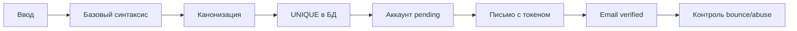

# Проверка и подтверждение email

## Коротко

Enterprise-grade проверка email — это не огромная регулярка. Это несколько независимых уровней:



Главный источник истины — не regex, а успешная доставка письма и переход по одноразовой ссылке.

## 1. Синтаксическая проверка остаётся умеренной

Обычно проверяют:

- строка;
- разумная длина, обычно до 254 символов;
- ровно один разделитель `@`;
- непустые local-part и domain;
- отсутствие whitespace и управляющих символов;
- домен имеет приемлемую структуру;
- адрес поддерживается используемым почтовым провайдером.

Не пытаются реализовать весь RFC собственной регуляркой. Полный email-синтаксис включает кавычки, экранирование, IP literals и другие редко используемые конструкции:

```text
"john..doe"@example.org
user@[IPv6:2001:db8::1]
```

Формально некоторые из них допустимы, но реальный почтовый провайдер приложения может их не поддержать.

OWASP рекомендует:

1. провести базовую проверку;
2. передать адрес почтовому серверу;
3. подтвердить владение через письмо.

### Для этого проекта

Текущая проверка достаточна для первого публичного API. Максимальную длину разумно ограничить 254 символами:

```ts
Schema.check(Schema.isMaxLength(254));
```

Не нужно сейчас писать полноценный RFC parser или добавлять зависимость только ради редких email-форматов.

## 2. Канонизация — отдельная продуктовая политика

Канонизация — преобразование разных представлений идентификатора в одну форму для сравнения.

У email есть проблема:

- доменная часть регистронезависима;
- local-part по RFC формально может быть регистрозависимой.

То есть стандарт требует учитывать потенциальную разницу:

```text
User@example.com
user@example.com
```

При этом RFC отдельно отмечает, что использовать регистрозависимые local-part нежелательно. На практике большинство массовых систем рассматривает email как регистронезависимый логин.

### Типичные стратегии

#### Строго по RFC

Нормализовать только домен:

```text
User@EXAMPLE.COM → User@example.com
```

Плюсы:

- не объединяет теоретически разные почтовые ящики.

Минусы:

- пользователи ожидают, что регистр не важен;
- появляется путаница при логине;
- большинство провайдеров всё равно не различает регистр.

#### Практичная consumer-стратегия

Нормализовать весь адрес:

```text
User@EXAMPLE.COM → user@example.com
```

Именно это сейчас делает Schema:

```ts
value.trim().toLowerCase();
```

Для wishlist-приложения это разумная политика. Важно считать её правилом продукта, а не универсальным требованием RFC.

#### Продвинутая enterprise-модель

Хранить оба значения:

```ts
{
  emailOriginal: "User@Example.com",
  emailCanonical: "user@example.com"
}
```

- `emailOriginal` — для отображения и отправки;
- `emailCanonical` — для поиска, входа и `UNIQUE`.

Это полезно в больших identity-системах, но для текущего проекта будет преждевременным усложнением.

## 3. Не применять Gmail-правила ко всем доменам

Consumer Gmail считает эти адреса одним ящиком:

```text
johnsmith@gmail.com
john.smith@gmail.com
johnsmith+shop@gmail.com
```

Но нельзя глобально:

- удалять точки из local-part;
- удалять часть после `+`.

Причины:

1. у других провайдеров точки могут быть значимы;
2. sub-addressing через `+` поддерживают не все серверы;
3. даже у Google Workspace поведение с точками может отличаться от обычного `gmail.com`;
4. пользователи используют `+tag`, чтобы отслеживать утечки адресов.

На enterprise-уровне provider-specific canonicalization либо вообще не делают, либо применяют только к точно известному провайдеру и осознанному продуктовому сценарию.

Для этого проекта правильно оставить:

```ts
trim().toLowerCase();
```

и не трогать точки и `+`.

## 4. Уникальность обязательно обеспечивает база

Приложение может проверить email до вставки для UX, но окончательное решение принимает PostgreSQL:

```sql
UNIQUE (email)
```

или `UNIQUE` по каноническому значению.

Иначе два параллельных запроса смогут создать одинаковый email.

Текущий подход правильный:

```ts
.insert(users)
.values(input)
.onConflictDoNothing({
  target: users.email,
})
.returning(userSelection)
```

На более строгом уровне добавляется `CHECK`, требующий lowercase:

```sql
CHECK (
  email = lower(email)
  AND email = btrim(email)
)
```

Распределение ответственности:

| Уровень             | Ответственность                       |
| ------------------- | ------------------------------------- |
| Effect Schema       | нормализация и понятная ранняя ошибка |
| PostgreSQL `CHECK`  | запрет ненормализованных данных       |
| PostgreSQL `UNIQUE` | защита от дублей и гонок              |
| Verification email  | доказательство владения ящиком        |

## 5. Владение email подтверждают письмом

Строка может выглядеть корректно и даже иметь существующий домен:

```text
ceo@example.com
```

Но это не доказывает, что пользователь владеет адресом.

Обычно модель содержит:

```ts
emailVerifiedAt: Date | null;
```

После регистрации:

1. создаётся пользователь со статусом `pending`;
2. генерируется криптографически случайный токен;
3. в БД сохраняется hash токена, а не сам токен;
4. токен имеет TTL — срок жизни;
5. письмо отправляется асинхронно;
6. пользователь открывает ссылку;
7. токен становится использованным;
8. устанавливается `emailVerifiedAt`.

Пример состояния:

```text
POST /users
  → user created
  → emailVerifiedAt = null
  → verification email queued

GET /verify-email?token=...
  → token valid and unused
  → emailVerifiedAt = now()
```

OWASP рекомендует одноразовый, ограниченный по времени токен, созданный криптографически безопасным генератором.

В больших системах письмо обычно отправляют не внутри транзакции создания пользователя, а через очередь или transactional outbox — таблицу событий, записываемую в той же транзакции. Это позволяет повторить отправку при временном отказе почтового провайдера.

Для текущего проекта outbox пока преждевременен. Сначала достаточно `emailVerifiedAt` и простого сервиса отправки письма.

## 6. MX/DNS-проверки обычно не являются жёстким условием

Можно проверить, что у домена есть:

- MX record;
- либо допустимый A/AAAA fallback.

Но enterprise-системы обычно не используют это как окончательное доказательство:

- DNS может быть временно недоступен;
- почтовая конфигурация может меняться;
- некоторые домены принимают почту нестандартно;
- наличие MX не доказывает существование конкретного ящика.

DNS-проверка может быть дополнительным сигналом для abuse/fraud-системы, но не заменяет письмо.

Для текущего проекта MX lookup добавлять не нужно.

## 7. Disposable email обычно не блокируют как «невалидный»

Disposable email — временный почтовый адрес.

Списки временных доменов:

- быстро устаревают;
- дают false positives;
- обходятся регистрацией нового домена;
- не доказывают злонамеренность пользователя.

Enterprise-продукты используют это как risk signal — сигнал риска:

```text
disposable domain
+ много регистраций с одного IP
+ высокая скорость запросов
+ подозрительное устройство
→ CAPTCHA / дополнительная проверка / блокировка
```

Не как синтаксическую ошибку email.

## 8. Не раскрывать существование аккаунта в критичных системах

Текущий ответ:

```http
409 USER_EMAIL_ALREADY_EXISTS
```

удобен для UX, но позволяет account enumeration — подбор существующих аккаунтов по email.

Атакующий может проверить:

```text
ceo@company.com      → 409, существует
employee@company.com → 201, не существовал
```

В системах с повышенными требованиями регистрация часто отвечает одинаково:

```text
Если этот адрес можно использовать, мы отправили письмо с дальнейшими инструкциями.
```

Причём одинаковыми должны быть не только текст и HTTP-код, но и примерно время ответа.

Это продуктовый компромисс:

- обычный pet/SaaS-проект — `409` часто допустим;
- банк, медицина, корпоративная identity-система — generic response предпочтительнее;
- дополнительно применяются rate limit, CAPTCHA и аудит.

Для текущего wishlist можно оставить `409`, но важно понимать, что это осознанный UX/security tradeoff.

## Практическая рекомендация для проекта

### Оставить сейчас

```ts
decode: (value) => value.trim().toLowerCase();
```

Базовую проверку:

```text
не более 254 символов
ровно один @
local-part не пустой
domain не пустой
domain содержит точку
нет whitespace
```

И базу:

```text
varchar(254)
CHECK normalized
UNIQUE
```

### Добавить при реализации аутентификации

```text
emailVerifiedAt
verification token hash
token expiration
single-use verification
rate limit
повторную отправку verification email
```

### Не добавлять сейчас

```text
огромную RFC regex
удаление точек для Gmail
удаление +tag
обязательный MX lookup
блокировку disposable domains
стороннюю dependency только ради email regex
```

## Итог

Реальный enterprise-подход:

> Не пытаться доказать валидность email одной функцией. Сначала безопасно разобрать и канонизировать строку, затем атомарно обеспечить уникальность в БД, а владение адресом доказать отправкой одноразовой ссылки.

Текущая Schema находится на правильном уровне для первого этапа. Следующее настоящее усиление — не более сложный filter, а `emailVerifiedAt` и flow подтверждения email.

## Источники

- [OWASP Input Validation — Email Address Validation](https://cheatsheetseries.owasp.org/cheatsheets/Input_Validation_Cheat_Sheet.html#email-address-validation) — базовая синтаксическая проверка, verification email, disposable addresses и sub-addressing.
- [RFC 5321, SMTP](https://www.rfc-editor.org/rfc/rfc5321#section-2.3.11) — local-part формально регистрозависим, domain регистронезависим.
- [OWASP Authentication Cheat Sheet](https://cheatsheetseries.owasp.org/cheatsheets/Authentication_Cheat_Sheet.html#authentication-responses) — предотвращение account enumeration при регистрации и восстановлении доступа.
