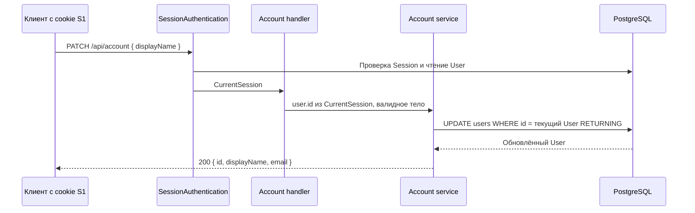

# Design

## Context

Мотивация: [proposal.md — Why](proposal.md#why). Граница модуля определяется [ADR-0006](../../../docs/adr/0006-account-module-for-self-service.md), а ошибки — [ADR-0005](../../../docs/adr/0005-technical-failure-logging-and-5xx-contract.md).

Опорные места в текущем коде:

| Файл                                                                             | Факт, влияющий на реализацию                                                              |
| -------------------------------------------------------------------------------- | ----------------------------------------------------------------------------------------- |
| `apps/api/src/modules/auth/api/session-authentication.ts:16–29`                  | `SessionAuthentication` предоставляет `CurrentSession` и объявляет ошибки аутентификации. |
| `apps/api/src/modules/auth/schemas/session/authenticated-session.schema.ts:7–10` | Идентификатор текущего User доступен как `CurrentSession.user.id`.                        |
| `apps/api/src/modules/auth/api/auth.api.errors.ts:50`                            | `AuthUnauthenticatedHttpError.instance` пока фиксирован на `authMePath`.                  |
| `apps/api/src/modules/auth/handlers/auth.handlers.ts:112–115`                    | `GET /api/auth/me` возвращает `currentSession.user`.                                      |
| `apps/api/src/modules/auth/service/auth.service.ts:253–275`                      | Каждый `authenticate` заново читает User из БД.                                           |
| `apps/api/src/modules/users/schemas/user.schema.ts:19–22`                        | `UserDisplayNameInputSchema` выполняет trim перед проверкой длины.                        |
| `apps/api/src/modules/users/schemas/user-response.schema.ts:9–13`                | `UserResponseSchema` ограничивает ответ полями `id`, `displayName`, `email`.              |
| `apps/api/src/infra/schemas/utils.ts:26–34`                                      | `withRequestParseOptions` отклоняет лишние поля.                                          |
| `apps/api/src/infra/db/migrations/0002_auth.ts:19`                               | Удаление User каскадно удаляет его Session.                                               |

Факты получены чтением кода; граница проверенного поведения указана в proposal.

## Goals / Non-Goals

**Goals:**

- Реализовать [контракт Account](specs/account/spec.md) одним вертикальным изменением существующего приложения.
- Сделать обновление одним SQL-запросом с декодированием результата на границе хранения.
- Переиспользовать действующие схемы и обработку ошибок без новых production-зависимостей.

**Non-Goals:**

- Не переносить общие схемы User в новый пакет ради одного endpoint.
- Не менять зависимости между `auth` и `users`, REPL и операции `users`.
- Не вводить блокировки, повтор SQL-запросов или обновление Session при изменении имени.

## Decisions

### HTTP-контракт

Новый маршрут: `PATCH /api/account`. Изменяется одно поле, поэтому PATCH подходит лучше существующего `PUT /api/users/:id`, требующего также email.

Новые файлы в `apps/api/src/modules/account/` следуют структуре соседних модулей:

- `api/account.api.constants.ts`: идентификатор группы и путь нового endpoint.
- `api/account.api.ts`: группа с одним endpoint и `.middleware(SessionAuthentication)`.
- `schemas/update-display-name.schema.ts`: `Schema.Struct({ displayName: UserDisplayNameInputSchema }).pipe(withRequestParseOptions)`.
- `schemas/account-operations.schema.ts`: операция `updateDisplayName` для API и типизированных диагностических полей.
- `handlers/account.handlers.ts`, `service/account.service.ts`, `repository/account.repository.ts` и соответствующие файлы ошибок.
- `account.module.ts`: сборка service и repository через Layer.

Ответ endpoint использует `UserResponseSchema`. Это ответ приватного Account, а не Public Profile из шага 2.4.
Отдельная копия правила Display Name и расширение `UpdateUserBodySchema` не нужны.

Query не предоставляет селектор User. Параметр `id` в query не участвует в выборе строки; произвольный суффикс пути не имеет маршрута.
Лишние поля тела получают 400 по существующей строгой схеме, вместо игнорирования опасной попытки указать id.

### Передача текущего User

Handler получает `CurrentSession` и передаёт `currentSession.user.id` в `AccountService.updateDisplayName`.
Ни params, ни query, ни тело не передают id в service.
Service принимает типизированные `UserId` и входную схему, repository — те же проверенные значения.
Это внутренний аргумент, а не клиентский селектор; защита внешней границы следует ADR-0006.

Альтернатива — читать `CurrentSession` прямо в service. Она привязывает service к контексту HTTP-запроса, хотя handler уже имеет нужное значение.

### Запись и актуальность ответа

Repository самостоятельно обращается к `DB`, в соответствии с ADR-0006.
SQL обновляет только `displayName` и `updatedAt: sql\`now()\``для переданного текущего id.
Он возвращает только`id`, `displayName`, `email`; результат декодируется `UserResponseSchema`.
Нельзя использовать `.set({ ...payload })`или возвращать старое`currentSession.user` после записи.

Один `UPDATE ... RETURNING` не требует отдельной транзакции.
Предварительный SELECT добавляет обращение к БД и не исключает удаление User между проверкой и записью.

Пустой `RETURNING` не считается успехом: service переводит его во внутреннюю типизированную ошибку, HTTP отвечает 500.
Этот редкий случай возможен при удалении User после аутентификации; каскадный внешний ключ не защищает снимок `CurrentSession`.
Обычная cookie уже удалённого User получает 401 при следующей аутентификации.

Сохранённое имя возвращается из результата UPDATE.
Следующий `GET /api/auth/me` с cookie любой действующей Session того же User получает актуальные данные через существующий `authenticate`; менять handler `me` или содержимое Session не требуется.

### Ошибки и совместимость auth

`AuthUnauthenticatedHttpError.instance` меняется с `Schema.tag(authMePath)` на `Schema.String`.
В `SessionAuthenticationLive` ошибка создаётся с путём из `HttpServerRequest` через существующий `getRequestPathname`.
Это единственное текущее место создания ошибки; декларация в `session-authentication.ts` сохраняет тот же класс.
Для `GET /api/auth/me` значение остаётся `/api/auth/me`; для Account оно становится `/api/account`.

Альтернатива — отдельная копия ошибки 401 в Account. Она не подходит: отказ создаётся общим middleware до handler Account.

Новые типизированные ошибки repository сохраняют `cause` и `operation` по существующему шаблону.
Service различает временный SQL-отказ через `isRetryableSqlFailure`, внутренний отказ и невалидную возвращённую запись.
Handler использует `makeTechnicalFailureHandler` с `module: 'account'`, операцией `updateDisplayName` и текущим `userId` по ADR-0005.
Он объявляет существующие `technicalHttpErrors`; дефекты обрабатывает `DefectBoundaryMiddlewareLive`.
Не добавляются коды `ACCOUNT_INTERNAL_ERROR` или `ACCOUNT_UNAVAILABLE`.

400 формирует `RequestValidationMiddlewareLive`; 401 и отказы аутентификации остаются ответственностью `SessionAuthenticationLive`.
При техническом ответе не обещается откат уже подтверждённого UPDATE: ошибка может возникнуть после записи при декодировании ответа.

### Сборка приложения

- `infra/api/api.ts` добавляет группу Account в `AppApi`.
- `infra/api/api-live.ts` добавляет handler Account в `groupsLive`, сохраняя общий middleware.
- `app.ts` добавляет `AccountModuleLive` в `ModulesLive`, используя существующий `DBLive`.
- `server.ts` добавляет `PATCH` в `HttpRouter.cors.allowedMethods`, сохраняя разрешённые origin и `credentials`.

`AccountModuleLive` не собирает второй экземпляр auth и не открывает новое глобальное соединение.
Конфигурация и PostgreSQL остаются зависимостями entry point.

Сейчас CORS разрешает только GET, POST, PUT и DELETE; без PATCH браузер не отправит новый запрос после preflight.
Разрешение PATCH проверяется через настоящий HTTP OPTIONS с настроенным origin, без ослабления списка origin.

### Проверки

HTTP-тесты с настоящим PostgreSQL размещаются в `modules/account/handlers/account.handlers.test.ts`.
Они следуют `auth.me.test.ts`: `TestDatabaseLive`, настоящий signup, cookie, `HttpRouter.toWebHandler`, освобождение приложения и тестовых User.
Каждый тест использует свои данные; очистка удаляет только созданные им строки.

Таблицы примеров покрывают длины 0/1/100/101, нестроковые значения и лишние поля.
FastCheck не нужен: это конечная матрица границ и HTTP-ответов.
Для отказов используются типизированные подмены зависимостей, но проверяется наблюдаемый HTTP-контракт, а не число вызовов.

Настоящий smoke запускает собранный сервер с PostgreSQL и двумя User.
Он доказывает signup → PATCH с cookie S1 → GET me с cookie S2 того же User, изоляцию B и отказы 400/401/404.
Ответ 404 проверяется для `PATCH /api/account/<id User B>` согласно [requirement «Отсутствие маршрута Account по id»](specs/account/spec.md#requirement-отсутствие-маршрута-account-по-id).

## Risks / Trade-offs

- Открытые маршруты `users` пока позволяют менять чужие данные → явно сохранить ограничение из ADR-0006; не объявлять шаг 2.3 полной авторизацией API.
- Тест, проверяющий только тело PATCH, пропустит возврат старого имени → проверить точное значение в БД и следующий GET me.
- Сохранение всего тела в SQL создаст возможность менять email → задать явные поля UPDATE и проверить отказ с лишними полями.
- Удаление User между аутентификацией и UPDATE → не возвращать ложный 200 при отсутствии строки; не вводить транзакцию ради снимка Session.
- Уже записанное имя при последующем техническом отказе → не утверждать, что любой ответ 500/503 означает отсутствие записи.
- Общий middleware сейчас логирует отказы аутентификации с `operation: me` → в этом изменении исправляется HTTP `instance`, а переустройство диагностического контекста не включается.

## Migration Plan

Миграции данных не нужны. После целевых проверок собрать API и выполнить smoke на настоящем сервере.
Обновить API-документацию и карту `learning/reference/system-map.html`, когда модуль реально существует.
Откат приложения удаляет новый endpoint, но сохраняет уже изменённые Display Name в существующей таблице.
