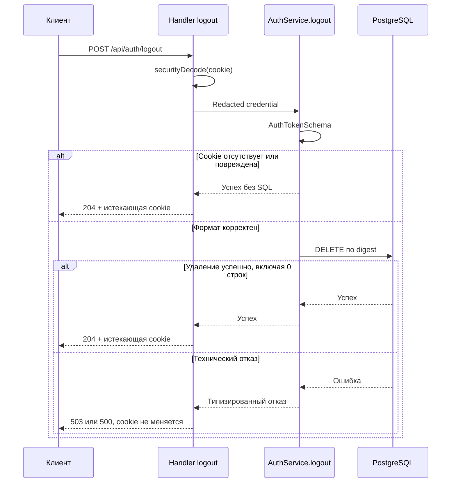

# Design

## Context

Мотивация описана в [proposal.md](proposal.md#why), внешний контракт — в [delta-спецификации](specs/user-auth/spec.md).

Наблюдения по текущему коду:

- `auth.api.ts:47–50` содержит закомментированный endpoint logout. `authLogoutPath` и `AuthOperation.logout` уже существуют.
- `SessionRepository.deleteByTokenDigest` в `repository/session/sesion.repository.ts:123–132` выполняет один `DELETE` по digest без проверки срока.
- `getByTokenDigest` исключает истекшие Session. Использовать его перед удалением не требуется.
- `AuthService.authenticate` декодирует credential через `AuthTokenSchema`, вычисляет digest и загружает Session и User.
  Logout не нужен этот путь: обязательная аутентификация дала бы `401` вместо согласованного `204`.
- `setSessionCookie` в `auth.handlers.ts:48–56` задаёт существующую политику cookie и зависит от `ModeConfig`.
- В установленном Effect `4.0.0-rc.108` `securityDecode(sessionCookieSecurity)` возвращает `Redacted<string>`.
  При отсутствии cookie он возвращает пустую строку; формат credential этот helper не проверяет.
- `securitySetCookie` регистрирует обработчик перед отправкой ответа. Поэтому момент его вызова влияет и на ответы с ошибками.
- HTTP-тесты `auth.login.test.ts` и `auth.me.test.ts` используют `HttpRouter.toWebHandler`, `AuthModuleLive` и PostgreSQL через `TestDatabaseLive`.

Решения о хранении Session и технических отказах заданы в [ADR-0001](../../../docs/adr/0001-postgresql-backed-sessions.md)
и [ADR-0005](../../../docs/adr/0005-technical-failure-logging-and-5xx-contract.md).

## Goals / Non-Goals

**Goals:**

- Разделить чтение HTTP-cookie, операцию logout и SQL-удаление по существующим границам handler/service/repository.
- Выполнить один SQL-запрос при корректном credential, без загрузки User и предварительной проверки срока Session.
- Зарегистрировать истекающую cookie только после успешного завершения операции сервиса.
- Использовать существующие типизированные технические ошибки, их перевод в HTTP и общий перехват дефектов.

**Non-Goals:**

- Изменение `SessionAuthentication`, создание optional middleware или нового контекстного сервиса для logout.
- Выход из всех Session User, очистка всех истекших Session, изменение `/me` и срока Session.
- Миграции БД, новые зависимости, автоматические повторы SQL-запроса или новые коды ошибок.
- Гарантия сохранности Session при любом `500`/`503`, когда сервер не знает результат SQL-команды.

## Decisions

### 1. Handler читает cookie сам

В `.handle(AuthOperation.logout, ...)` handler вызывает `HttpApiBuilder.securityDecode(sessionCookieSecurity)`
и передаёт полученный `Redacted<string>` в `AuthService.logout`.
Endpoint использует `HttpApiSchema.NoContent` и `technicalHttpErrors`, без payload и без `.middleware(SessionAuthentication)`.

`SessionAuthentication` и его Layer остаются неизменными. Альтернатива с обязательным middleware противоречит ответу `204` без Session.
Optional middleware пока имел бы одного потребителя и не оправдывает отдельную абстракцию.
Вернуться к нему при втором потребителе, например Reservation с User или Guest по [ADR-0002](../../../docs/adr/0002-user-and-guest-reservation-access.md).
Этот будущий выбор не входит в изменение logout.

### 2. Сервис декодирует credential и удаляет по digest

Добавить `logout(credential: Redacted<string>): Effect<void, AuthLogoutError>` в интерфейс `AuthService`.
`AuthLogoutError` описывает только технические отказы; отдельная ошибка недействительной Session не нужна.

- Декодировать значение через существующий `AuthTokenSchema`.
- Если декодирование завершается `SchemaError`, закончить операцию успешно без обращения к repository.
  Это охватывает отсутствие cookie, пустое значение и повреждённый формат.
- Для корректного значения вычислить `digestSessionToken` от декодированных байтов и вызвать `deleteByTokenDigest`.
- Удаление нуля строк означает успех: неизвестная Session и повторный logout не являются отказом.
- Удаление существующей истекшей строки также означает успех; остальные строки не затрагиваются.

Перехват `SchemaError` ограничивается декодированием. Нельзя перехватить все ошибки всей операции и вернуть успех:
это превратило бы недоступность PostgreSQL в ложный `204`.

Альтернатива `authenticate` → удаление добавляет чтение Session и User, отказывает истекшей Session и создаёт гонку между чтением и удалением.
Один существующий `DELETE` не требует новой транзакции или изменения repository.

### 3. Ошибки используют существующий путь перевода

Добавить `LogoutOperationError` на основе `SessionDeleteByTokenDigestError` и включить его в сопоставление технических ошибок сервиса.
Использовать `mapTechnicalError` и `isRetryableSqlFailure`: временная ошибка становится `AuthUnavailableError`, прочая SQL-ошибка — `AuthInternalError`.
`AuthLogoutError` не расширяет публичный HTTP-контракт новыми тегами.

Handler использует `makeTechnicalErrorHandler` с `operation: AuthOperation.logout`, `userId: null`.
Загружать User только ради лога не требуется. Непредвиденное исключение обрабатывает существующий `DefectBoundaryMiddleware`.
Общие поля Problem Details, `errorId` и защита данных применяются по `api-errors` и ADR-0005; отдельный механизм не вводится.

После расширения интерфейса обновить подмены `AuthService` в `auth.handlers.test.ts` и `auth.me.test.ts`.
Не менять поведение их прежних сценариев. На этапе apply найти ссылки на экспортированный `AuthService` через LSP перед изменением интерфейса.

### 4. Cookie истекает только после успеха сервиса

Сохранить общие атрибуты выдачи и истечения в одной локальной политике рядом с `setSessionCookie`:
`httpOnly: true`, `sameSite: 'lax'`, `path: '/api'`, `secure: mode === 'production'`.
Выдача Session по-прежнему добавляет свой `expiresAt` и `Duration.millis(sessionLifetimeMs)`.

После успешного `service.logout` вызвать `HttpApiBuilder.securitySetCookie(sessionCookieSecurity, '', ...)`
с общей политикой, `maxAge: Duration.seconds(0)` и `expires: new Date(0)`.
Ветка отсутствующей или повреждённой cookie тоже проходит через этот вызов.

Не регистрировать истечение заранее, в `ensuring` или в обработчике технической ошибки:
`securitySetCookie` добавляет обработчик отправки ответа, который иначе затронет `500`/`503`.
Не наследовать недельный `maxAge` при истечении cookie.

### 5. Проверка подтверждает HTTP-контракт и состояние БД

Создать `handlers/auth.logout.test.ts` по ближайшему HTTP-паттерну:
реальный `AuthModuleLive`, `HttpRouter.toWebHandler`, изолированный PostgreSQL и очистка данных через `Effect.acquireRelease`.

Основной сценарий создаёт ровно две Session User A и одну Session User B.
После logout проверить точные строки и поля, а не только уменьшение числа строк.
Истекшую Session проверить прямым запросом к таблице: `getByTokenDigest` не отличает истекшую строку от удалённой.

Таблица примеров покрывает отсутствие cookie, пустое значение, `abc`, корректную cookie без строки, истекшую Session и повторный logout.
В каждом случае проверять `204`, пустое тело, ровно одну истекающую cookie, `Max-Age=0` и epoch `Expires`.
Отдельные сценарии test/production проверяют общие атрибуты cookie.

Типизированные `503`/`500` и дефект проверяются через HTTP с подменой соответствующего отказа, как в существующих тестах.
Ответы `503`/`500` проверяются по статусу, Problem Details и отсутствию `Set-Cookie` для `wishlist_session`.

На этапе apply дополнительно выполнить временный smoke-сценарий настоящего Node server с изолированным PostgreSQL и cookie jar.
Проверить signup → login → logout → `/me`: старая cookie получает `401`, вторая получает `200`, повторный logout получает `204`.
Для реальной недоступности ограничить доступ приложения к временному PostgreSQL до запроса и проверить `503` без `Set-Cookie`.
Не останавливать общую development-БД; временное окружение принадлежит этому сценарию.
Если `204` доказан только Web-handler тестом, это не считается проверкой настоящего Node server.

## Risks / Trade-offs

- Потеря соединения после выполнения `DELETE` → `503` не доказывает сохранность Session; cookie остаётся, повторный logout безопасен.
- Отличающийся `Path` или политика `Secure` → cookie не удаляется корректно; общие параметры и отдельные HTTP-сценарии предотвращают расхождение.
- Широкий перехват ошибок → ложный `204`; перехват ограничивается `SchemaError` декодирования, SQL-ошибки сохраняются.
- Подменённый отказ не доказывает реальную недоступность PostgreSQL → отдельный smoke-сценарий проверяет её до запроса.
- Истекшая строка не видна через `getByTokenDigest` → проверять удаление напрямую в БД.

## Migration Plan

Развернуть обычную сборку API; изменений схемы и миграции данных нет.
При откате версии уже удалённые Session не восстанавливаются. Пользователь получает новую Session через login.
Проверки и порядок реализации заданы в `tasks.md`.
